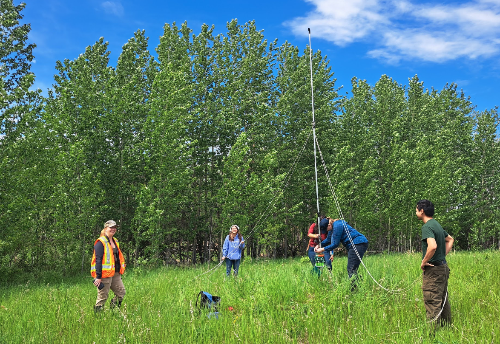

# Abstract and Context

This course outline describes ENCS299-855: Vertebrate Biodiversity Monitoring with Sensors at the University of Alberta. The course focuses on developing applied field competencies in the deployment and use of environmental sensors for passive, continuous monitoring of wildlife, as commonly applied in conservation practice.

{style="float:left`;" fig-alt="Bat ARU deployment" fig-align="center"}

# Agenda Legend

- **S**: Safety / Orientation block  
- **T**: Talk / Lecture block  
- **A**: Activity block  
- **L**: Lunch / Break  

# Materials

## Students Should Bring

### Safety & Comfort
- PPE  
- Sunglasses  
- Sunscreen  
- Insect repellent  
- Water  
- Lunch  
- Rain gear  

### Learning
- Notebook and pencil (preferred in rain)  
- Hand lens  
- Plant ID book (optional)  
- Smartphone (camera + timer)  
- Clothes with pockets or small field bag  

## Equipment List

### Instructor / Course Equipment
- Insect order flash cards  
- Colour name flash cards  
- Photo of malaise trap  
- Q-tips  
- Hand sanitizer  
- 15 aerial insect nets  
- First aid kit  
- Vials & lids  
- Microscopes (2)  
- Folding table  
- Tape measures (30 m)  
- Pan traps  
- Water + dish soap  
- Flagging tape  
- Bamboo stakes  
- Plant ID books / apps  
- Compass  
- Camera  
- 50 × 50 cm quadrat  
- Grill sticks  
- Duct tape, scissors  
- Hand lens  
- Mallet  
- Malaise traps (lab + field school)  
- Microcapillary tubes + sharps container  
- Sharpies  
- Cooler + ice packs  
- Wagon  
- Student list & contacts  
- Printed safety checklist  
- Beaufort scale  
- Field guides (insects, bumblebees, plants)  
- Microcentrifuge tubes  
- Datasheets (printed)  
- Ziploc bags  

---

# Day 1: Mill Creek Ravine  

## Foundations and Sensor Deployment

**BUS ARRIVES**

### S1: Arrival + Orientation (30–40 min)

- Safety meeting (10 min)  
- Walk to site (10 min)  
- Instructor introductions (3 min)  
- Course overview (5 min)  
- Sensor overview (5 min)  
- Student introductions (5–10 min)  

---

### T1: Why Use Sensors? (15 min)

**Goal:** Conceptual grounding  

- What is a sensor? (ARUs, camera traps, environmental sensors)  
- Biodiversity signals: acoustic, visual, temporal  
- Advantages vs traditional surveys  
- Conservation applications  

---

### A1: Detection vs Observation (20 min)

**Goal:** Detectability and bias  

- Conduct short visual + auditory survey  
- Compare detections vs expected presence  
- Introduce imperfect detection  

---

### A2: Sensor Familiarization (20 min)

**Goal:** Hands-on exposure  

- ARU setup and function  
- Camera trap setup and triggering  
- Metadata collection (GPS, habitat notes)  

---

### A3: Experimental Design Challenge (15 min)

**Goal:** Link sensors to research questions  

- Design a monitoring question  
- Select:
  - Sensor type  
  - Placement strategy  
  - Sampling duration  

---

### A4: Deployment Best Practices (10 min)

- ARU placement (height, orientation)  
- Camera trap setup (angle, avoiding false triggers)  

---

### L1: Lunch (45 min)

---

### T2: Data Structure & Metadata (15 min)

**Goal:** Prepare for analysis  

- What is a record?  
- Importance of:
  - Time  
  - Location  
  - Effort  
- Intro to tagging / annotation  

---

### A5: Deploy Sensors (20 min)

**Goal:** Execute sampling design  

- Deploy:
  - 1 ARU  
  - 1 camera trap  
- Record metadata  

---

### A6: Predict Outcomes (20 min)

**Goal:** Hypothesis formation  

- Predict:
  - Species presence  
  - Temporal activity  
  - Sensor performance  

---

### A7: Rapid Habitat Assessment (20 min)

**Goal:** Link habitat to detection  

- Measure:
  - Canopy cover  
  - Vegetation density  
  - Human disturbance  

---

### Collect Data (20–40 min)

- Retrieve short deployments or validate setups  

---

### S2: End of Day Discussion (20 min)

- Recap key concepts  
- Student reflections (1 takeaway each)  

**BUS DEPARTS**

---

# Day 2: Whitemud Creek Ravine  

## Data + Inference

### Safety Meeting (10 min)

---

### A5: Data Retrieval & QA/QC (20 min)

- Download sensor data  
- Identify:
  - Corrupt files  
  - False triggers  
  - Noise  

---

### B6: Annotation & Classification (60 min)

- Acoustic identification (spectrograms)  
- Image classification (camera traps)  
- Concepts:
  - Confidence  
  - Observer variation  
  - Misclassification  

---

### Lunch (45 min)

---

### A6: Detection Histories (20 min)

- Build detection / non-detection matrices  
- Introduce sampling effort and replication  

---

### A7: Sensor Comparison Analysis (30–40 min)

- Compare ARU vs camera detections  
- Evaluate strengths and limitations  

---

### End of Day Discussion (20 min)

- Key insight: data ≠ truth without interpretation  

---

# Day 3: Ministik Biological Research Station  

## Synthesis and Ecology

### Safety Meeting (10 min)

---

### C1: From Detection to Ecology (15 min)

- From detections → ecological inference  
- Habitat use, activity, interactions  

---

### C3: Temporal Activity Patterns (20 min)

- Plot detections by time of day  
- Identify activity patterns  

---

### C2: Habitat Use Analysis (30 min)

- Compare detections across habitats  
- Relate to environmental variables  

---

### Lunch (45 min)

---

### Activity 15: Sensor Limitations (15 min)

- Identify:
  - What sensors missed  
  - Sources of bias  

---

### C5: Species Interactions (20 min)

- Predator–prey overlap  
- Human–wildlife interactions  

---

### C6: Mini Research Synthesis (60 min)

- Group presentations:
  - Question  
  - Methods  
  - Findings  
  - Limitations  
  - Conservation relevance  

---

### Final Discussion (30 min)

- Course synthesis  
- Student reflections  
- Conservation implications  

**BUS DEPARTS**
